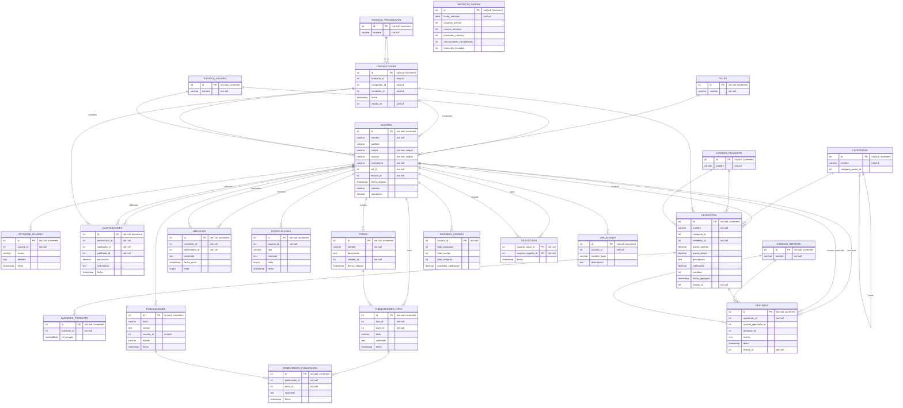

```mermaid
erDiagram

  CUENTAS {
    int id PK "not null, increment"
    varchar nombre "not null"
    varchar apellido
    varchar correo "not null, unique"
    varchar usuario "not null, unique"
    varchar contrasena "not null"
    int rol_id "not null"
    int estado_id "not null"
    timestamp fecha_registro
    varchar campus
    decimal reputacion
  }
  ROLES {
    int id PK "not null, increment"
    varchar nombre "not null"
  }
  ESTADOS_USUARIO {
    int id PK "not null, increment"
    varchar nombre "not null"
  }
  ACTIVIDAD_USUARIO {
    int id PK "not null, increment"
    int usuario_id "not null"
    varchar accion
    text detalles
    timestamp fecha
  }
  CALIFICACIONES {
    int id PK "not null, increment"
    int transaccion_id "not null"
    int calificador_id "not null"
    int calificado_id "not null"
    decimal puntuacion
    text comentario
    timestamp fecha
  }
  TRANSACCIONES {
    int id PK "not null, increment"
    int producto_id "not null"
    int comprador_id "not null"
    int vendedor_id "not null"
    timestamp fecha
    int estado_id "not null"
  }
  ESTADOS_TRANSACCION {
    int id PK "not null, increment"
    varchar nombre "not null"
  }
  PRODUCTOS {
    int id PK "not null, increment"
    varchar nombre "not null"
    int categoria_id
    int vendedor_id "not null"
    decimal precio_anterior
    decimal precio_actual
    text descripcion
    decimal calificacion
    int cantidad
    timestamp fecha_agregado
    int estado_id "not null"
  }
  CATEGORIAS {
    int id PK "not null, increment"
    varchar nombre "not null"
    int categoria_padre_id
  }
  ESTADOS_PRODUCTO {
    int id PK "not null, increment"
    varchar nombre "not null"
  }
  IMAGENES_PRODUCTO {
    int id PK "not null, increment"
    int producto_id "not null"
    mediumblob url_imagen
  }
  MENSAJES {
    int id PK "not null, increment"
    int remitente_id "not null"
    int destinatario_id "not null"
    text contenido
    timestamp fecha_envio
    tinyint leido
  }
  NOTIFICACIONES {
    int id PK "not null, increment"
    int usuario_id "not null"
    varchar tipo
    text mensaje
    tinyint leido
    timestamp fecha
  }
  PUBLICACIONES {
    int id PK "not null, increment"
    varchar titulo
    text cuerpo
    int usuario_id "not null"
    varchar estado
    timestamp fecha
  }
  PUBLICACIONES_FORO {
    int id PK "not null, increment"
    int foro_id "not null"
    int autor_id "not null"
    varchar titulo
    text contenido
    timestamp fecha
  }
  FOROS {
    int id PK "not null, increment"
    varchar nombre "not null"
    text descripcion
    int creador_id "not null"
    timestamp fecha_creacion
  }
  COMENTARIOS_PUBLICACION {
    int id PK "not null, increment"
    int publicacion_id "not null"
    int autor_id "not null"
    text contenido
    timestamp fecha
  }
  REPORTES {
    int id PK "not null, increment"
    int reportante_id "not null"
    int usuario_reportado_id
    int producto_id
    text motivo
    timestamp fecha
    int estado_id "not null"
  }
  ESTADOS_REPORTE {
    int id PK "not null, increment"
    varchar nombre "not null"
  }
  RESUMEN_USUARIO {
    int usuario_id PK "not null"
    int total_productos
    int total_ventas
    int total_compras
    decimal promedio_calificacion
  }
  SEGUIDORES {
    int usuario_sigue_id PK "not null"
    int usuario_seguido_id PK "not null"
    timestamp fecha
  }
  UBICACIONES {
    int id PK "not null, increment"
    int usuario_id "not null"
    varchar nombre_lugar
    text descripcion
  }
  METRICAS_DIARIAS {
    int id PK "not null, increment"
    date fecha_metricas "not null"
    int usuarios_activos
    int nuevos_usuarios
    int productos_creados
    int transacciones_completadas
    int mensajes_enviados
  }

  %% RELACIONES
  CUENTAS ||--o{ ACTIVIDAD_USUARIO : ""
  CUENTAS ||--o{ CALIFICACIONES : "calificador"
  CUENTAS ||--o{ CALIFICACIONES : "calificado"
  CUENTAS ||--o{ MENSAJES : "remitente"
  CUENTAS ||--o{ MENSAJES : "destinatario"
  CUENTAS ||--o{ NOTIFICACIONES : ""
  CUENTAS ||--o{ PUBLICACIONES : ""
  CUENTAS ||--o{ PUBLICACIONES_FORO : "autor"
  CUENTAS ||--o{ REPORTES : "reportante"
  CUENTAS ||--o{ REPORTES : "usuario_reportado"
  CUENTAS ||--o{ RESUMEN_USUARIO : ""
  CUENTAS ||--o{ SEGUIDORES : "sigue"
  CUENTAS ||--o{ SEGUIDORES : "seguido"
  CUENTAS ||--o{ UBICACIONES : ""
  CUENTAS ||--o{ PRODUCTOS : "vendedor"
  CUENTAS ||--o{ FOROS : "creador"

  ROLES ||--o{ CUENTAS : ""
  ESTADOS_USUARIO ||--o{ CUENTAS : ""
  PRODUCTOS ||--o{ IMAGENES_PRODUCTO : ""
  CATEGORIAS ||--o{ PRODUCTOS : ""
  CATEGORIAS ||--|{ CATEGORIAS : "padre"
  ESTADOS_PRODUCTO ||--o{ PRODUCTOS : ""
  TRANSACCIONES ||--o{ CALIFICACIONES : ""
  TRANSACCIONES ||--o{ PRODUCTOS : ""
  TRANSACCIONES ||--o{ CUENTAS : "comprador"
  TRANSACCIONES ||--o{ CUENTAS : "vendedor"
  ESTADOS_TRANSACCION ||--o{ TRANSACCIONES : ""
  FOROS ||--o{ PUBLICACIONES_FORO : ""
  PUBLICACIONES_FORO ||--o{ COMENTARIOS_PUBLICACION : ""
  PUBLICACIONES ||--o{ COMENTARIOS_PUBLICACION : ""
  PRODUCTOS ||--o{ REPORTES : ""
  ESTADOS_REPORTE ||--o{ REPORTES : ""
  ESTADOS_REPORTE ||--o{ REPORTES : ""
  ESTADOS_TRANSACCION ||--o{ TRANSACCIONES : ""
  ESTADOS_PRODUCTO ||--o{ PRODUCTOS : ""
  ESTADOS_USUARIO ||--o{ CUENTAS : ""
```