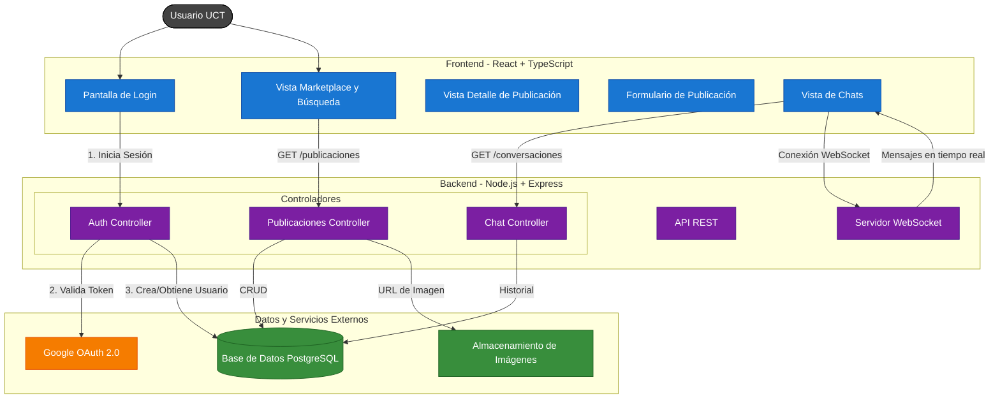

# Flujo de Datos de Alto Nivel

Este diagrama ofrece una vista simplificada de la arquitectura, enfocándose en la interacción y el flujo de datos entre los componentes principales del sistema en su estado actual.

