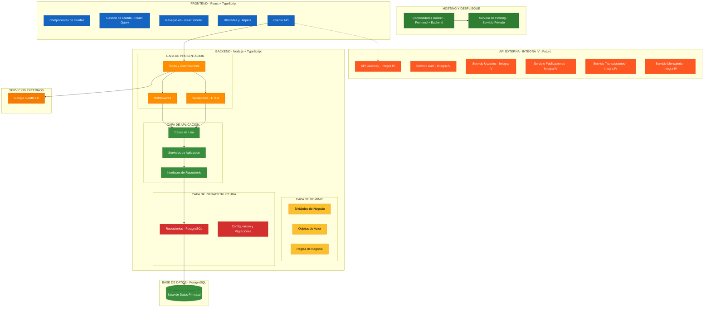

# Diagrama de Arquitectura de Sistema y Despliegue

Este diagrama describe la arquitectura completa del sistema Marketplace UCT, abarcando desde el despliegue hasta la estructura interna del software, siguiendo los principios de Clean Architecture.

