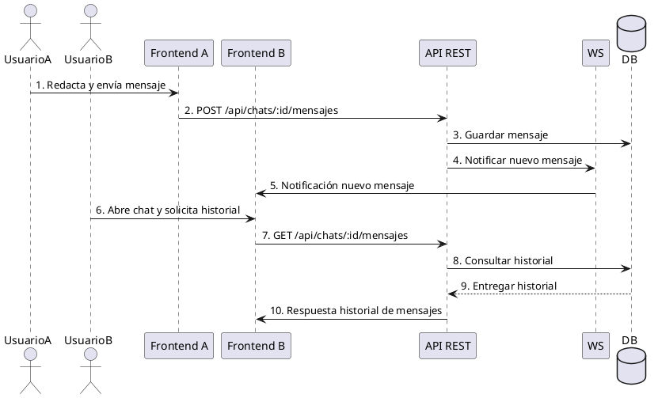

# Diagrama de Secuencia — Chat y Notificación

Este diagrama representa la secuencia de mensajes para la interacción de chat entre usuarios y la notificación de nuevos mensajes en el Marketplace UCT.

---

## 2. Chat y Notificación

**Participantes:**  
- Usuario A (Frontend)  
- Usuario B (Frontend)  
- API REST  
- WS (WebSocket)  
- DB

---

### Secuencia: Chat y Notificación

1. **Usuario A (Frontend)** redacta mensaje y lo envía.
2. **Frontend** realiza petición `POST /api/chats/:id/mensajes` a **API REST**.
3. **API REST** valida y persiste el mensaje en **DB**.
4. **API REST** notifica a **WS** la llegada de nuevo mensaje.
5. **WS** envía notificación en tiempo real a **Usuario B (Frontend)**.
6. **Usuario B (Frontend)** abre el chat y solicita historial con `GET /api/chats/:id/mensajes` a **API REST**.
7. **API REST** recupera historial desde **DB** y responde a **Frontend**.

---

### Diagrama Visual (PlantUML)

