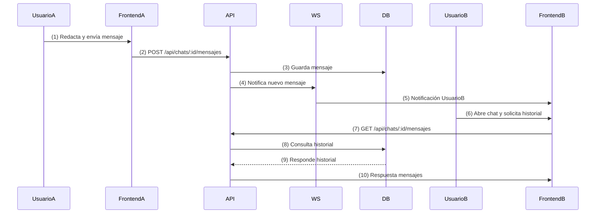

# Diagrama de Secuencia — Chat y Notificación

Este diagrama representa la secuencia de mensajes para la interacción de chat entre usuarios y la notificación de nuevos mensajes en el Marketplace UCT.

---

## Secuencia: Chat y Notificación

