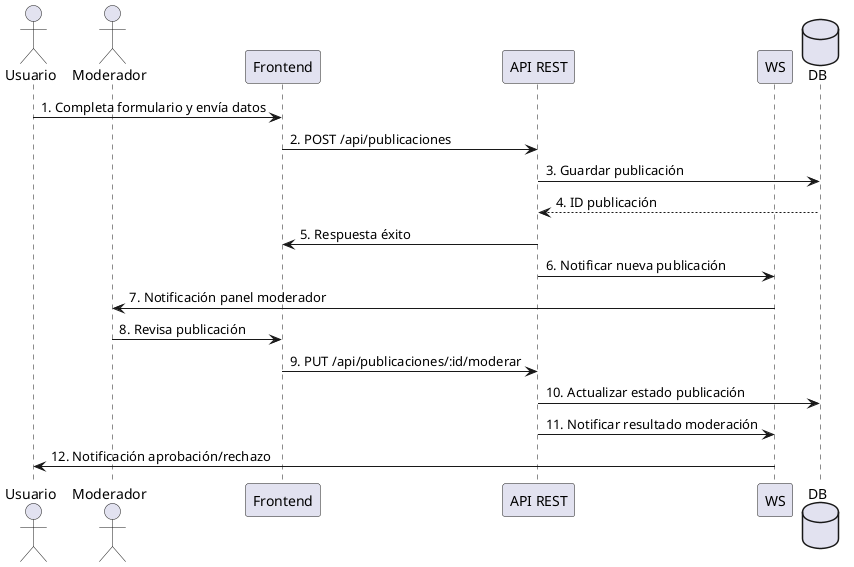

# Diagrama de Secuencia — Publicar y Moderar

Este diagrama representa la secuencia de mensajes entre Frontend, API REST, WebSocket (WS) y Base de Datos (DB) para los procesos de publicación de un anuncio y su moderación en el Marketplace UCT.

---

## 1. Publicar y Moderar Publicación

**Participantes:**  
- Usuario (Frontend)  
- API REST  
- DB  
- Moderador/Admin (Frontend)  
- WS (WebSocket para notificaciones)

---

### Secuencia: Publicar

1. **Usuario (Frontend)** completa formulario y envía datos de publicación.
2. **Frontend** realiza petición `POST /api/publicaciones` a **API REST**.
3. **API REST** valida datos y solicita persistencia a **DB**.
4. **DB** guarda la publicación y responde con su ID.
5. **API REST** envía respuesta de éxito a **Frontend**.
6. **API REST** notifica a **WS** para alertar al Moderador/Admin de nueva publicación pendiente de revisión.
7. **WS** envía notificación en tiempo real al panel de **Moderador**.

### Secuencia: Moderar

8. **Moderador/Admin (Frontend)** revisa publicación en su panel.
9. **Moderador** aprueba o rechaza usando `PUT /api/publicaciones/:id/moderar` en **API REST**.
10. **API REST** actualiza estado en **DB**.
11. **API REST** notifica a **WS** el resultado de la moderación.
12. **WS** envía notificación en tiempo real al **Usuario** sobre el estado (aprobado/rechazado).

---

### Diagrama Visual (PlantUML)

