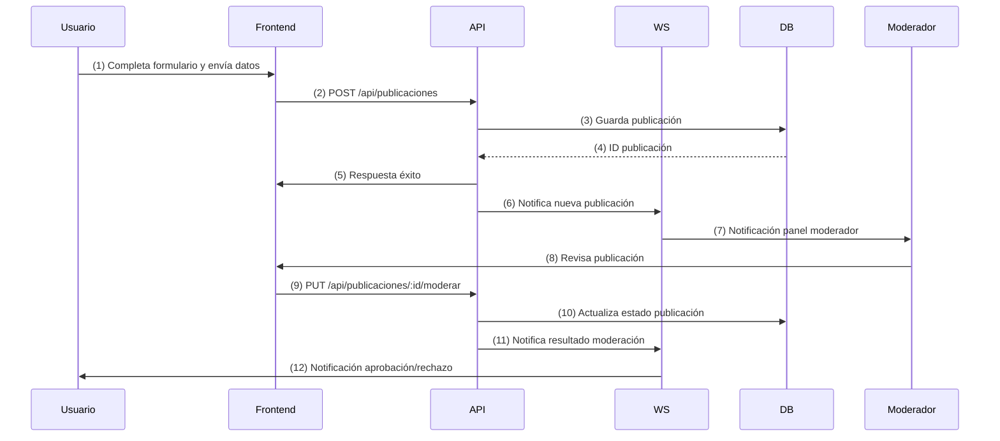

# Diagrama de Secuencia — Publicar y Moderar

Este diagrama representa la secuencia de mensajes entre Frontend, API REST, WebSocket (WS) y Base de Datos (DB) para los procesos de publicación de un anuncio y su moderación en el Marketplace UCT.

---

## Secuencia: Publicar y Moderar Publicación

---
