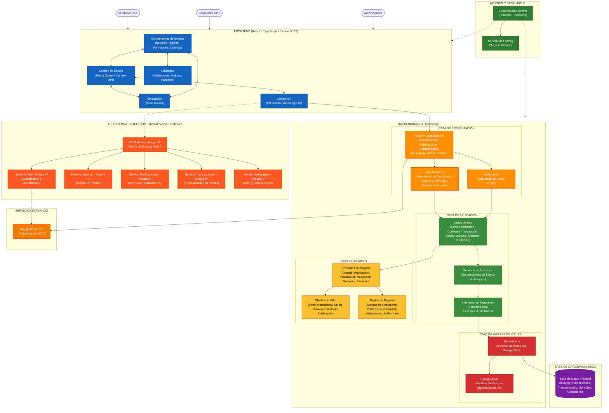

# DIAGRAMA DE ARQUITECTURA - MARKETPLACE UCT

## Arquitectura Hexagonal (Clean Architecture)

Este diagrama muestra la arquitectura del sistema del marketplace UCT siguiendo los principios de Clean Architecture y Arquitectura Hexagonal.



## Descripción de los Componentes

### 🚀 Hosting y Despliegue - Docker + Cloud Services (Verde Oscuro)
- **Contenedores Docker**: Empaquetado de aplicaciones Frontend y Backend
- **Servicio de Hosting**: Plataforma de despliegue (Railway, Vercel, Heroku)
- **Dominio y DNS**: Configuración de dominio personalizado

### 🔗 API Externa - Integra IV - Microservicios + Gateway (Rojo Intenso)
**Preparada para integración futura con el equipo de Integra IV**
- **API Gateway - Integra IV**: Punto de entrada único para todas las peticiones
- **Servicio Auth - Integra IV**: Manejo centralizado de autenticación y autorización
- **Servicio Usuarios - Integra IV**: Gestión completa de perfiles y usuarios
- **Servicio Publicaciones - Integra IV**: CRUD y gestión de publicaciones del marketplace
- **Servicio Transacciones - Integra IV**: Procesamiento de ventas y transacciones
- **Servicio Mensajería - Integra IV**: Sistema de chat y comunicación

### 🖥️ Frontend - React + TypeScript + Tailwind CSS (Azul)
- **Componentes de Interfaz**: Elementos reutilizables de la interfaz de usuario
- **Gestión de Estado**: Manejo del estado con React Query y Context API
- **Navegación**: Sistema de enrutamiento con React Router
- **Utilidades**: Funciones de validación, formateo y helpers
- **Cliente API**: **Preparado para conectar con Integra IV** o funcionar independientemente

### ⚙️ Backend - Node.js + TypeScript + Clean Architecture

#### 📡 Capa de Presentación - Express.js (Naranja)
- **Rutas y Controladores**: Endpoints HTTP para todas las funcionalidades
- **Middlewares**: Autenticación, validación y manejo de errores
- **Validadores**: Esquemas de validación de datos de entrada

#### 🔧 Capa de Aplicación - Casos de Uso (Verde)
- **Casos de Uso**: Lógica específica de cada funcionalidad del marketplace
- **Servicios de Aplicación**: Orquestación de operaciones complejas
- **Interfaces de Repositorio**: Contratos para el acceso a datos

#### 💼 Capa de Dominio - Lógica de Negocio (Amarillo)
- **Entidades de Negocio**: Modelos principales del sistema
- **Objetos de Valor**: Tipos inmutables con validaciones específicas
- **Reglas de Negocio**: Lógica central del dominio del marketplace

#### 🔌 Capa de Infraestructura - Prisma ORM (Rojo)
- **Repositorios**: Implementaciones concretas para PostgreSQL
- **Configuración**: Variables de entorno y migraciones de base de datos

### 🗄️ Base de Datos - PostgreSQL (Morado)
- **Base de Datos Principal**: Almacenamiento de toda la información del sistema

### 🌐 Servicios Externos - Google OAuth 2.0 (Naranja)
- **Google OAuth 2.0**: Autenticación exclusiva para usuarios UCT

## Arquitectura Modular y Preparación para API

### Diseño Actual (Desarrollo Independiente)
- El Frontend se conecta directamente al Backend desarrollado internamente
- Funcionalidad completa sin dependencias externas
- Base sólida para el marketplace UCT

### Preparación Futura (Integra IV)
- **Cliente API** preparado para cambiar la conexión
- **Interfaces compatibles** con los servicios de Integra IV
- **Transición transparente** cuando esté disponible la API externa
- **Líneas punteadas** indican conexiones futuras preparadas

## Stack Tecnológico Detallado

### Frontend
- **Framework**: React 18+ con TypeScript
- **Estilos**: Tailwind CSS para diseño responsivo
- **Estado**: React Query + Context API
- **Navegación**: React Router v6
- **Build**: Vite para desarrollo y construcción

### Backend
- **Runtime**: Node.js con TypeScript
- **Framework Web**: Express.js
- **Arquitectura**: Clean Architecture / Hexagonal
- **ORM**: Prisma para manejo de base de datos
- **Validación**: Zod para esquemas de datos

### Base de Datos
- **SGBD**: PostgreSQL 15+
- **Migraciones**: Prisma Migrate
- **Conexión**: Pool de conexiones optimizado

### Infraestructura
- **Contenedores**: Docker + Docker Compose
- **Despliegue**: Railway, Vercel o Heroku
- **Autenticación**: Google OAuth 2.0 para validación UCT
```
