## DIAGRAMA DE COMPONENTES PROYECTO MARKETPLACE UCT

### Arquitectura del Sistema

```mermaid
graph TB
    %% Frontend Layer
    subgraph "Frontend – React/TypeScript + Tailwind CSS"
        UI[Interfaz de Usuario]
        DASH[Dashboard Usuario]
        ADMIN[Panel Administrador]
        MSGS[Mensajeria Directa]
        FOROS[Foros y Grupos]
        NOTIF[Notificaciones]
    end

    %% API Gateway
    API[API Gateway - Express Node.js]

    %% Backend Services
    subgraph "Servicios Backend"
        AUTH[Autenticacion OAuth y Gestion de Roles]
        USER[Gestion de Usuarios y Perfiles]
        PUB[Gestion de Publicaciones]
        PROD[Gestion de Productos y Categorias]
        TRANS[Transacciones y Confirmaciones]
        VAL[Valoraciones y Reputacion]
        MSG[Servicio de Mensajeria]
        ACT[Actividad de Usuario]
        REP[Gestion de Reportes]
        MOD[Moderacion y IA NLP Futuro]
        REC[Recomendaciones ML]
        NOTS[Servicio de Notificaciones]
    end

    %% Database Layer
    subgraph "Base de Datos – PostgreSQL"
        DB_USER[(Usuarios y Perfiles)]
        DB_PUB[(Publicaciones)]
        DB_PROD[(Productos Categorias Imagenes)]
        DB_TRANS[(Transacciones Historial)]
        DB_VAL[(Valoraciones)]
        DB_MSG[(Mensajes Conversaciones)]
        DB_FOROS[(Foros Grupos)]
        DB_ACT[(Actividad Usuario)]
        DB_REP[(Reportes)]
        DB_NOTIF[(Notificaciones)]
        DB_LOC[(Ubicaciones Campus)]
    end

    %% External Services
    subgraph "Servicios Externos"
        OAUTH[Google OAuth 2.0]
        STORAGE[Almacenamiento AWS S3 o Cloudinary]
        CDN[CDN CloudFlare]
        ML_API[API ML Recomendaciones]
    end

    %% Real-time Communication
    WS[WebSocket Server Socket.io]

    %% Conexiones Frontend → API
    UI --> API
    DASH --> API
    ADMIN --> API
    MSGS --> WS
    FOROS --> API
    NOTIF --> WS

    %% API → Backend Services
    API --> AUTH
    API --> USER
    API --> PUB
    API --> PROD
    API --> TRANS
    API --> VAL
    API --> MSG
    API --> ACT
    API --> REP
    API --> MOD
    API --> REC
    API --> NOTS

    %% Backend → Base de Datos
    AUTH --> DB_USER
    USER --> DB_USER
    USER --> DB_LOC
    PUB --> DB_PUB
    PROD --> DB_PROD
    PROD --> STORAGE
    TRANS --> DB_TRANS
    TRANS --> DB_USER
    TRANS --> DB_PROD
    VAL --> DB_VAL
    VAL --> DB_TRANS
    VAL --> DB_USER
    MSG --> DB_MSG
    ACT --> DB_ACT
    REP --> DB_REP
    REP --> DB_USER
    MOD --> DB_PUB
    MOD --> DB_MSG
    MOD --> DB_REP
    REC --> DB_PUB
    REC --> DB_USER
    REC --> DB_PROD
    NOTS --> DB_NOTIF
    FOROS --> DB_FOROS

    %% Servicios Externos
    AUTH --> OAUTH
    UI --> CDN
    REC --> ML_API

    %% WebSocket connections
    WS --> MSG
    WS --> NOTS

    %% Almacenamiento
    PROD --> STORAGE

    %% Clases y colores para visualizacion
    classDef frontend fill:#1976D2,stroke:#0D47A1,stroke-width:3px,color:#FFFFFF
    classDef backend fill:#7B1FA2,stroke:#4A148C,stroke-width:3px,color:#FFFFFF
    classDef database fill:#388E3C,stroke:#1B5E20,stroke-width:3px,color:#FFFFFF
    classDef external fill:#F57C00,stroke:#E65100,stroke-width:3px,color:#FFFFFF
    classDef websocket fill:#C2185B,stroke:#880E4F,stroke-width:3px,color:#FFFFFF
    classDef api fill:#D32F2F,stroke:#B71C1C,stroke-width:3px,color:#FFFFFF
    classDef future fill:#607D8B,stroke:#37474F,stroke-width:2px,color:#FFFFFF

    class UI,DASH,ADMIN,MSGS,FOROS,NOTIF frontend
    class AUTH,USER,PUB,PROD,TRANS,VAL,MSG,ACT,REP,REC,NOTS backend
    class MOD future
    class DB_USER,DB_PUB,DB_PROD,DB_TRANS,DB_VAL,DB_MSG,DB_FOROS,DB_ACT,DB_REP,DB_NOTIF,DB_LOC database
    class OAUTH,STORAGE,CDN,ML_API external
    class WS websocket
    class API api
```

---

### Componentes Principales

#### Frontend (Azul)
- **React + TypeScript + Tailwind CSS**
- Interfaz responsiva y moderna
- Dashboard para usuario y administrador
- Mensajería directa, foros y notificaciones

#### Backend (Morado)
- **Node.js + Express**
- Microservicios: gestión de usuarios, publicaciones, productos, transacciones, valoraciones, reportes y recomendaciones
- Moderación con IA/NLP (futuro)

#### Base de Datos (Verde)
- **PostgreSQL**
- Tablas: usuarios, perfiles, publicaciones, productos, categorías, imágenes, transacciones, valoraciones, actividad, reportes, foros, notificaciones, ubicaciones

#### Servicios Externos (Naranja)
- **Google OAuth 2.0** para autenticación
- **Almacenamiento en la nube** para archivos e imágenes
- **CDN** para optimización de recursos
- **API ML** para recomendaciones inteligentes

#### Tiempo Real (Rosa)
- **WebSocket** para mensajería y notificaciones en vivo

#### Funcionalidades Futuras (Gris)
- **IA/NLP** para moderación automática

---

### Mejoras y actualizaciones implementadas

✅ **Servicios agregados:**
- Gestión completa de productos y categorías
- Sistema de valoraciones y reputación
- Tracking de actividad de usuarios y reportes
- Moderación escalable y foros para comunidad

✅ **Conexiones mejoradas:**
- Productos conectados con transacciones y recomendaciones
- Valoraciones vinculadas a transacciones y usuarios
- Reportes integrados con moderación y actividad

✅ **Base de datos actualizada:**
- Esquema normalizado y ampliado
- Separación clara de responsabilidades por dominio
