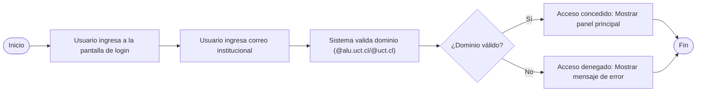
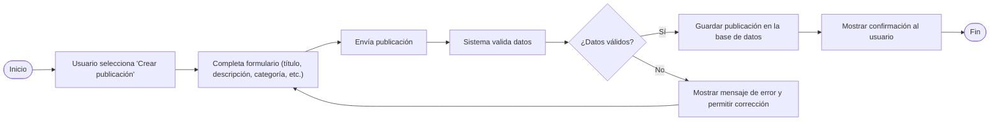
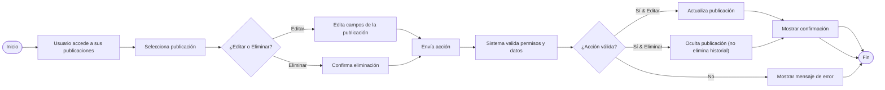
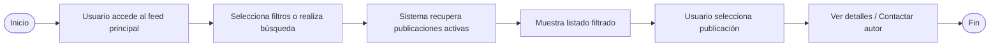
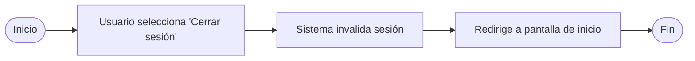

# Diagramas de Flujo de Casos Principales — Marketplace UCT

Este documento presenta los diagramas de flujo formales y profesionales para los procesos clave del Marketplace UCT: login institucional, gestión de publicaciones (creación/edición/eliminación), visualización del feed y cierre de sesión. Cada gráfico se acompaña de una explicación que resume su lógica y propósito.

---

## 1. **Login Institucional**

### Explicación

El usuario accede al sistema y realiza el proceso de autenticación con su correo institucional. El sistema valida el dominio y, según corresponda, concede el acceso o muestra un error. Este flujo garantiza que sólo miembros verificados de la UCT pueden ingresar.

### Diagrama

---

## 2. **Creación de Publicación**

### Explicación

El usuario accede al formulario para crear una nueva publicación, completa los datos requeridos y envía la solicitud. El sistema valida la información y, si todo es correcto, almacena la publicación; en caso contrario, informa el error y permite la corrección.

### Diagrama

---

## 3. **Edición/Eliminación de Publicación**

### Explicación

El usuario accede a sus publicaciones y elige editar o eliminar una. El sistema verifica los permisos y valida la acción. Si es válida, actualiza o elimina (oculta) la publicación y confirma el resultado; si no, muestra el error correspondiente.

### Diagrama

---

## 4. **Visualización del Feed**

### Explicación

El usuario navega el feed principal, aplica filtros o realiza búsquedas. El sistema recupera y muestra las publicaciones activas, permitiendo que el usuario revise detalles o contacte al autor.

### Diagrama

---

## 5. **Logout (Cerrar Sesión)**

### Explicación

El usuario opta por cerrar sesión. El sistema invalida la sesión y redirige a la pantalla de inicio, asegurando la protección de la cuenta.

### Diagrama

