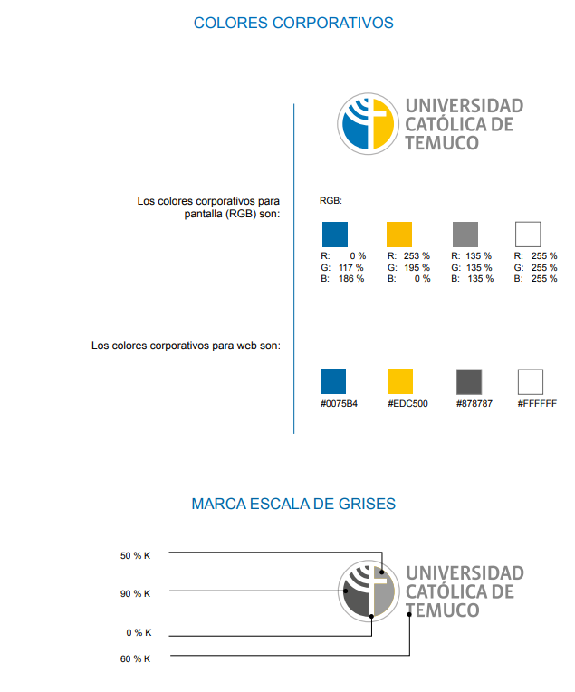

# Guía de Estilos Visuales — Marketplace UCT

Este documento define los estilos para los componentes principales de la aplicación, alineados con la identidad gráfica de la Universidad Católica de Temuco. Los ejemplos y códigos proporcionados sirven como referencia rápida para desarrolladores y diseñadores, evitando inconsistencias y garantizando profesionalismo visual.

---

## Paleta de Colores Institucional UCT

Referencia oficial:




| Nombre                | Hex      | RGB              | Uso principal                |
|-----------------------|----------|------------------|------------------------------|
| Azul UCT              | #0075B4  | 0, 117, 180      | Elementos principales, botón |
| Amarillo UCT          | #EDC500  | 237, 197, 0      | Detalles, énfasis, alerta    |
| Gris UCT              | #878787  | 135, 135, 135    | Bordes, iconos secundarios   |
| Blanco                | #FFFFFF  | 255, 255, 255    | Fondo, tarjetas, inputs      |
| Negro 60%             | #888888  | 136,136,136      | Texto secundario             |
| Gris claro            | #F4F6F8  | 244,246,248      | Fondo alternativo            |
| Azul Hover            | #005A8E  | 0, 90, 142       | Botón hover/acento           |

---

## 1. Botones

**Estilos base:**  
- Fondo: Azul UCT (#0075B4)
- Texto: Blanco (#FFFFFF)
- Borde: Azul UCT o Gris UCT según contexto
- Radio esquinas: 8px
- Sombra: 0 2px 8px rgba(0,117,180,0.09)
- Padding: 12px 24px
- Fuente: Roboto, Arial, sans-serif

**Estados:**

| Estado      | Fondo      | Texto     | Borde       | Sombra      | Opacidad | Cursor    |
|-------------|------------|-----------|-------------|-------------|----------|-----------|
| Normal      | #0075B4    | #FFFFFF   | #0075B4     | sutil       | 1        | pointer   |
| Hover       | #005A8E    | #FFFFFF   | #005A8E     | media       | 1        | pointer   |
| Focus       | #0075B4    | #FFFFFF   | #EDC500     | fuerte      | 1        | pointer   |
| Disabled    | #F4F6F8    | #878787   | #878787     | none        | 0.6      | not-allowed|

**Ejemplo visual:**

```html
<!-- Normal -->
<button style="background:#0075B4;color:#fff;border:1px solid #0075B4;border-radius:8px;box-shadow:0 2px 8px rgba(0,117,180,0.09);padding:12px 24px;">
  Botón Principal
</button>
<!-- Hover -->
<button style="background:#005A8E;color:#fff;border:1px solid #005A8E;border-radius:8px;box-shadow:0 4px 16px rgba(0,90,142,0.15);">
  Botón Hover
</button>
<!-- Focus -->
<button style="background:#0075B4;color:#fff;border:2px solid #EDC500;border-radius:8px;box-shadow:0 4px 16px rgba(237,197,0,0.22);">
  Botón Focus
</button>
<!-- Disabled -->
<button style="background:#F4F6F8;color:#878787;border:1px solid #878787;border-radius:8px;opacity:0.6;" disabled>
  Botón Deshabilitado
</button>
```

---

## 2. Inputs (Campos de texto)

**Estilos base:**  
- Fondo: Blanco (#FFFFFF)
- Texto: Gris UCT (#878787) o Negro 60%
- Borde: Gris UCT (#878787)
- Radio esquinas: 6px
- Sombra: 0 1px 4px rgba(135,135,135,0.08)
- Padding: 10px 16px
- Fuente: Roboto, Arial, sans-serif

**Estados:**

| Estado      | Fondo      | Texto     | Borde       | Sombra      |
|-------------|------------|-----------|-------------|-------------|
| Normal      | #FFFFFF    | #878787   | #878787     | sutil       |
| Hover       | #FFFFFF    | #0075B4   | #0075B4     | media       |
| Focus       | #FFFFFF    | #0075B4   | #EDC500     | fuerte      |
| Disabled    | #F4F6F8    | #878787   | #878787     | none        |

**Ejemplo visual:**

```html
<!-- Normal -->
<input style="background:#fff;color:#878787;border:1px solid #878787;border-radius:6px;box-shadow:0 1px 4px rgba(135,135,135,0.08);padding:10px 16px;" placeholder="Escribe aquí">
<!-- Hover -->
<input style="background:#fff;color:#0075B4;border:1.5px solid #0075B4;border-radius:6px;box-shadow:0 2px 8px rgba(0,117,180,0.12);" placeholder="Input en hover">
<!-- Focus -->
<input style="background:#fff;color:#0075B4;border:2px solid #EDC500;border-radius:6px;box-shadow:0 3px 12px rgba(237,197,0,0.18);" placeholder="Input en focus">
<!-- Disabled -->
<input style="background:#F4F6F8;color:#878787;border:1px solid #878787;border-radius:6px;" disabled placeholder="Deshabilitado">
```

---

## 3. Tarjetas

**Estilos base:**  
- Fondo: Blanco (#FFFFFF)
- Texto: Negro 60% (#888888) o Gris UCT
- Borde: Gris UCT (#878787)
- Radio esquinas: 10px
- Sombra: 0 2px 8px rgba(0,117,180,0.08)
- Padding: 24px

**Estados:**

| Estado      | Fondo      | Borde       | Sombra    |
|-------------|------------|-------------|-----------|
| Normal      | #FFFFFF    | #878787     | sutil     |
| Hover       | #F4F6F8    | #0075B4     | media     |

**Ejemplo visual:**

```html
<!-- Normal -->
<div style="background:#fff;color:#888888;border:1px solid #878787;border-radius:10px;box-shadow:0 2px 8px rgba(0,117,180,0.08);padding:24px;">
  <strong>Título de Tarjeta</strong><br>Contenido principal aquí.
</div>
<!-- Hover -->
<div style="background:#F4F6F8;color:#888888;border:2px solid #0075B4;border-radius:10px;box-shadow:0 4px 16px rgba(0,117,180,0.13);">
  <strong>Tarjeta Hover</strong>
</div>
```

---

## 4. Modales

**Estilos base:**  
- Fondo: Blanco (#FFFFFF)
- Texto: Gris UCT (#878787)
- Borde: Azul UCT (#0075B4) 2px
- Radio esquinas: 16px
- Sombra: 0 8px 32px rgba(0,117,180,0.25)
- Padding: 32px

**Ejemplo visual:**

```html
<div style="background:#fff;color:#878787;border:2px solid #0075B4;border-radius:16px;box-shadow:0 8px 32px rgba(0,117,180,0.25);padding:32px;width:320px;margin:auto;">
  <strong>Modal de Confirmación</strong><br>¿Estás seguro que deseas continuar?
</div>
```

---

## 5. Alertas

**Estilos base:**  
- Radio: 8px
- Padding: 12px 24px
- Borde izquierdo: 5px sólido, color según tipo
- Sombra: 0 2px 8px, color según tipo

| Tipo       | Fondo      | Texto     | Borde Izq   | Icono      |
|------------|------------|-----------|-------------|------------|
| Éxito      | #38B000    | #FFFFFF   | #38B000     | ✔          |
| Error      | #D7263D    | #FFFFFF   | #D7263D     | ❌         |
| Atención   | #EDC500    | #222222   | #EDC500     | ⚠️         |
| Info       | #0075B4    | #FFFFFF   | #0075B4     | ℹ️         |

**Ejemplo visual:**

```html
<!-- Éxito -->
<div style="background:#38B000;color:#fff;border-left:5px solid #38B000;padding:12px 24px;border-radius:8px;box-shadow:0 2px 8px rgba(56,176,0,0.12);">
  ✔ Operación realizada con éxito.
</div>
<!-- Error -->
<div style="background:#D7263D;color:#fff;border-left:5px solid #D7263D;padding:12px 24px;border-radius:8px;">
  ❌ Error al procesar la solicitud.
</div>
<!-- Atención -->
<div style="background:#EDC500;color:#222222;border-left:5px solid #EDC500;padding:12px 24px;border-radius:8px;">
  ⚠️ Revisa los campos obligatorios.
</div>
<!-- Info -->
<div style="background:#0075B4;color:#fff;border-left:5px solid #0075B4;padding:12px 24px;border-radius:8px;">
  ℹ️ Información relevante para el usuario.
</div>
```

---

## 6. Bordes, Radios y Sombras

- **Bordes:** 1-2px sólidos, color institucional o gris.
- **Radio de esquinas:** 6-16px según componente.
- **Sombras sutiles:** `box-shadow: 0 2px 8px rgba(0,117,180,0.09);`
- **Sombras medias:** `box-shadow: 0 4px 16px rgba(0,117,180,0.15);`
- **Sombras fuertes:** `box-shadow: 0 8px 32px rgba(0,117,180,0.25);`

---

## 7. Tipografía

- Fuente principal: **Roboto** o **Arial**
- Color principal de texto: Gris UCT (#878787)
- Color secundario de texto: Negro 60% (#888888)
- Tamaños recomendados: 16px para cuerpo, 20px para títulos, 14px para subtítulos

---

## 8. Accesibilidad y Consistencia

- Mantener contraste suficiente entre fondo y texto.
- Foco visible en botones e inputs.
- No usar colores fuera de la paleta institucional.
- Actualizar este documento ante cualquier cambio aprobado por la universidad.

---

**Referencias oficiales:**  
Manual de Marca UCT —   
Pantone y CMYK —   
RGB y web — 

---