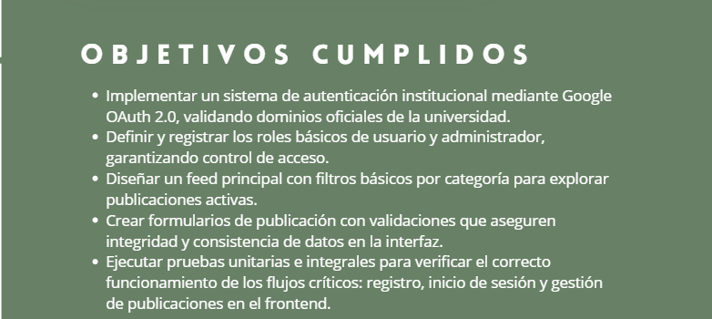

# Informe de Sprint

## Resumen de tareas completadas y features implementadas

Durante este sprint se cumplieron los siguientes objetivos principales:

- **Implementación de sistema de autenticación institucional:** Se integró Google OAuth 2.0, validando únicamente dominios oficiales de la universidad para el acceso.
- **Definición y registro de roles de usuario:** Se establecieron y documentaron roles básicos (usuario y administrador), implementando un sistema de control de acceso.
- **Diseño de feed principal:** Se desarrolló una interfaz para el feed principal, permitiendo la exploración de publicaciones activas mediante filtros básicos por categoría.
- **Creación de formularios de publicación:** Se diseñaron formularios con validaciones de integridad y consistencia de datos, asegurando la calidad de la información ingresada en la interfaz.
- **Pruebas unitarias e integrales:** Se llevaron a cabo pruebas sobre los flujos críticos (registro, inicio de sesión y gestión de publicaciones en el frontend) para garantizar el correcto funcionamiento del sistema.

---

## Registro de problemas y bloqueos

Durante el desarrollo del sprint surgieron los siguientes inconvenientes:

- **Bugs en la validación de dominios OAuth:** Inicialmente, algunos dominios no eran reconocidos correctamente, impidiendo el acceso a usuarios válidos.
- **Conflictos de merge:** Se detectaron conflictos al integrar ramas relacionadas con el sistema de roles y la interfaz de publicaciones, debido a cambios simultáneos en archivos compartidos.
- **Errores de coordinación:** La comunicación entre responsables de backend y frontend fue insuficiente en algunos momentos, provocando desacoplamiento temporal en la integración de formularios y lógica de validación.

---

## Decisiones tomadas y ajustes realizados

Para resolver los problemas mencionados se tomaron las siguientes acciones:

- **Ajuste de filtros y reglas en la validación OAuth:** Se amplió la lista de dominios válidos y se implementaron logs más detallados para identificar errores de autenticación.
- **Estrategia de integración continua:** Se establecieron rutinas de integración diaria y revisiones cruzadas de código para minimizar conflictos de merge.
- **Reuniones de sincronización:** Se programaron reuniones breves de seguimiento entre los equipos de frontend y backend para alinear requerimientos y avances.

---

## Recomendaciones y lecciones aprendidas

- **Fomentar la comunicación constante:** Mantener reuniones diarias breves (stand-ups) y utilizar canales de comunicación efectivos para prevenir desacoples.
- **Documentar criterios de aceptación y reglas de negocio:** Registrar de manera explícita los requisitos y reglas en tickets o tareas para reducir ambigüedades.
- **Promover la integración continua:** Hacer commits frecuentes y revisiones de código colaborativas para detectar y resolver conflictos tempranamente.
- **Automatizar pruebas y validaciones:** Priorizar el desarrollo de pruebas automatizadas para todos los flujos críticos desde el inicio del sprint.

---

## Publicación y accesibilidad

Este informe está disponible para todo el equipo y recoge de manera transparente todos los problemas relevantes, las soluciones implementadas y recomendaciones claras para mejorar el desempeño en futuros sprints.