##DIAGRAMA DE COMPONENTES PROYECTO MARKETPLACE UCT

## Arquitectura del Sistema

```mermaid
graph TB
    %% Frontend Layer
    subgraph "Frontend - React/TypeScript + Tailwind CSS"
        UI[Interface de Usuario]
        DASH[Dashboard]
        ADMIN[Panel Admin]
        MSGS[Mensajería]
        FORUMS[Foros]
        NOTIF[Notificaciones]
    end

    %% API Gateway
    API[API Gateway<br/>Express/Node.js]

    %% Backend Services
    subgraph "Backend Services"
        AUTH[Autenticación OAuth<br/>+ Gestión de Roles<br/>Admin/Usuario]
        USER[Gestión de<br/>Usuarios/Perfiles<br/>+ Reputación]
        PUB[Gestión de<br/>Publicaciones]
        TRANS[Sistema de<br/>Transacciones<br/>+ Confirmaciones]
        MSG[Servicio de<br/>Mensajería]
        MOD[Moderación<br/>+ IA/NLP Futuro]
        REC[Sistema de<br/>Recomendaciones ML]
        NOTS[Servicio de<br/>Notificaciones]
    end

    %% Database Layer
    subgraph "Base de Datos - PostgreSQL"
        DB_USER[(Usuarios/Perfiles<br/>+ Reputación)]
        DB_PUB[(Publicaciones<br/>Categorías)]
        DB_TRANS[(Transacciones<br/>Historial)]
        DB_MSG[(Mensajes<br/>Conversaciones)]
        DB_FORUM[(Foros<br/>Grupos)]
        DB_NOTIF[(Notificaciones)]
        DB_LOC[(Ubicaciones<br/>Campus)]
    end

    %% External Services
    subgraph "Servicios Externos"
        OAUTH[Google OAuth 2.0<br/>Validación UCT]
        STORAGE[Almacenamiento<br/>AWS S3/Cloudinary]
        CDN[CDN<br/>CloudFlare]
        ML_API[API ML<br/>Recomendaciones]
    end

    %% Real-time Communication
    WS[WebSocket Server<br/>Socket.io]

    %% Connections Frontend -> API
    UI --> API
    DASH --> API
    ADMIN --> API
    MSGS --> WS
    FORUMS --> API
    NOTIF --> WS

    %% API -> Backend Services
    API --> AUTH
    API --> USER
    API --> PUB
    API --> TRANS
    API --> MSG
    API --> MOD
    API --> REC
    API --> NOTS

    %% Backend -> Database
    AUTH --> DB_USER
    USER --> DB_USER
    USER --> DB_LOC
    PUB --> DB_PUB
    TRANS --> DB_TRANS
    TRANS --> DB_USER
    MSG --> DB_MSG
    MOD --> DB_PUB
    MOD --> DB_MSG
    REC --> DB_PUB
    REC --> DB_USER
    NOTS --> DB_NOTIF
    
    %% Forums connections
    API --> DB_FORUM

    %% External Services
    AUTH --> OAUTH
    PUB --> STORAGE
    UI --> CDN
    REC --> ML_API

    %% WebSocket connections
    WS --> MSG
    WS --> NOTS

    %% Styling con colores más vibrantes
    classDef frontend fill:#1976D2,stroke:#0D47A1,stroke-width:3px,color:#FFFFFF
    classDef backend fill:#7B1FA2,stroke:#4A148C,stroke-width:3px,color:#FFFFFF
    classDef database fill:#388E3C,stroke:#1B5E20,stroke-width:3px,color:#FFFFFF
    classDef external fill:#F57C00,stroke:#E65100,stroke-width:3px,color:#FFFFFF
    classDef websocket fill:#C2185B,stroke:#880E4F,stroke-width:3px,color:#FFFFFF
    classDef api fill:#D32F2F,stroke:#B71C1C,stroke-width:3px,color:#FFFFFF
    classDef future fill:#607D8B,stroke:#37474F,stroke-width:2px,color:#FFFFFF

    class UI,DASH,ADMIN,MSGS,FORUMS,NOTIF frontend
    class AUTH,USER,PUB,TRANS,MSG,REC,NOTS backend
    class MOD future
    class DB_USER,DB_PUB,DB_TRANS,DB_MSG,DB_FORUM,DB_NOTIF,DB_LOC database
    class OAUTH,STORAGE,CDN,ML_API external
    class WS websocket
    class API api
```

## Componentes Principales

### Frontend (Azul)
- **React + TypeScript + Tailwind CSS**
- Interface responsive y moderna
- Dashboard para usuarios y administradores

### Backend (Morado)
- **Node.js + Express**
- Arquitectura de microservicios
- API RESTful con autenticación OAuth

### Base de Datos (Verde)
- **PostgreSQL**
- Esquema normalizado
- Almacenamiento de usuarios, publicaciones y transacciones

### Servicios Externos (Naranja)
- **Google OAuth 2.0** para autenticación UCT
- **Almacenamiento en la nube** para archivos
- **CDN** para optimización de recursos

### Tiempo Real (Rosa)
- **WebSocket** para mensajería instantánea
- Notificaciones en vivo

### Funcionalidades Futuras (Gris)
- **IA/NLP** para moderación automática
